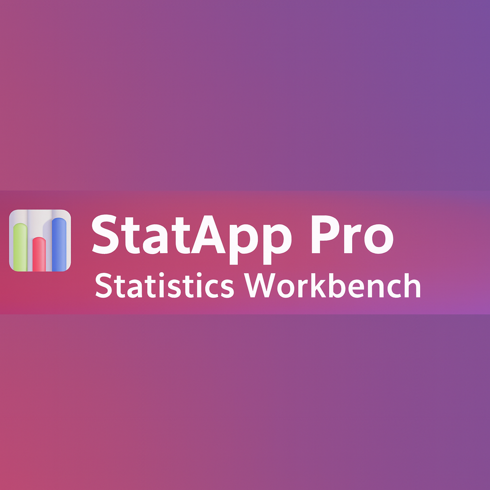

# 📊 StatApp Pro — Statistics Workbench

An interactive web app built with **Streamlit** and **Plotly**, designed for students and professionals to quickly compute and visualize statistical results.

🔗 **Live App:** [https://statapp-pro.streamlit.app](https://statapp-pro.streamlit.app)

---

## 🚀 Features

- 🧮 **Descriptive Statistics:** Mean, Median, Mode, Variance, IQR  
- 📈 **Distribution Calculators:** Normal, t, Chi-Square, Binomial, Poisson, Exponential, Uniform  
- 🧪 **Inference Tests:**  
  - One-Sample Z & T tests  
  - Two-Sample T & Proportion Tests  
  - Paired T-Tests  
- 🎯 **Universal P-Value Finder:** All-tailed results (`<`, `>`, `≠`, `≤`, `≥`) with visual shaded plots  
- 📊 **Interactive Graphs:** Automatically generated using Plotly

---

## 🧠 Example Screenshot

---

## ⚙️ Technologies
- Python 3.12+
- Streamlit
- NumPy
- SciPy
- Plotly

---

## 🧑‍💻 Author
**Antonio Hernandez**  
📧 originalantoniohernandez@gmail.com  
🌐 [https://statapp-pro.streamlit.app](https://statapp-pro.streamlit.app)

---

### 💡 About
StatApp Pro was created as an open learning tool inspired by StatCrunch — offering modern design, real-time computation, and visual interpretation for statistics students.
